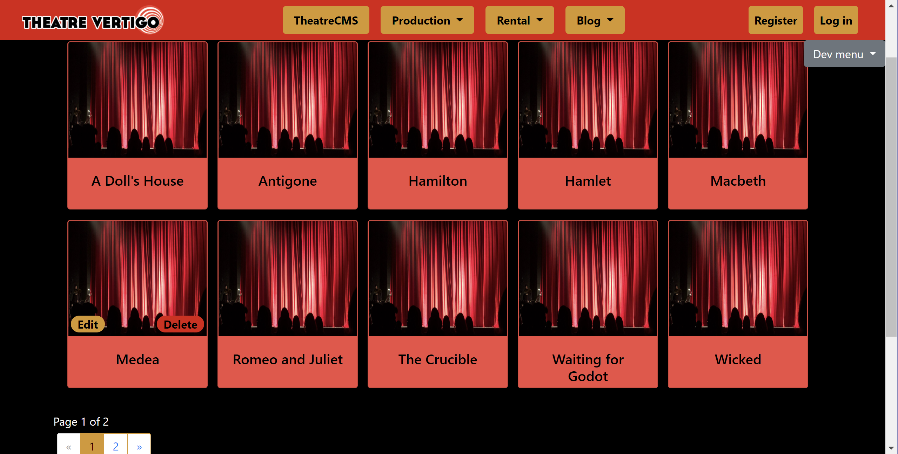

# Live Project
- [Introduction](#introduction)
- [Adding search and pagination](#adding-search-and-pagination)
- [Index page styling](#index-page-styling)
  - [Screenshots](./Screenshots)
- [Conclusion](#conclusion)
## Introduction
I spent the past 2 weeks working with an Agile/Scrum development team made up of my peers at The Tech Academy. During the 2 week sprint, we worked on a content management service website for a theater company. The existing code base was created in C# with ASP.NET MVC and code-first Entity Framework, and both front-end and back-end stories were assigned to us. This offered a great opportunity to not only apply the raw material I learned from The Tech Academy, but to also apply the problem-solving techniques that I learned. My area of focus for the project was the Productions CRUD pages. I encountered many situations that I wasn't familiar with, but I proved to myself that I could find the answers I needed. Of course, if I hit a formidable wall, I knew it was time to ask for help.

Outside of the coding aspects, I found the Agile/Scrum project management to be excellent. The Daily Stand-Ups were a useful insight to what teammates were working on, and regular communication with the team ensured less problems. In combination with the weekly reviews, the project progression went smoothly.

Please continue to see my favorite parts of my contributions.

## Adding search and pagination
The search bar I implemented filters through the index of productions by their title and/or their description. The productions are sorted alphabetically, and search results are also shown in alphabetical order. Each index page can show up to 10 productions.
```
public ViewResult Index(string sortOrder, string currentFilter, string searchString, int? page)
        {
            ViewBag.CurrentSort = sortOrder;
            ViewBag.NameSortParm = String.IsNullOrEmpty(sortOrder) ? "title" : ""; //sorts alphabetically

            if (searchString != null)
            {
                page = 1;
            }
            else
            {
                searchString = currentFilter;
            }
            ViewBag.CurrentFilter = searchString;

            var productions = from p in db.Productions
                              select p;
            if (!String.IsNullOrEmpty(searchString))
            {
                productions = productions.Where(p => p.Title.Contains(searchString)
                                       || p.Description.Contains(searchString));
            }
            switch (sortOrder)
            {
                case "title":
                    productions = productions.OrderByDescending(p => p.Title);
                    break;
                default:
                    productions = productions.OrderBy(p => p.Title);
                    break;
            }
            int pageSize = 10; // 10 productions per page, 2 rows of 5
            int pageNumber = (page ?? 1);
            return View(productions.ToPagedList(pageNumber, pageSize));
        }
```
*Jump to: [page top](#live-project), [introduction](#introduction), [adding search and pagination](#adding-search-and-pagination), [index page styling](#index-page-styling), [conclusion](#conclusion)*

## Index page styling
One of my tasks was to style the index page of the productions area so that each production appeared as a card. I replaced the default index skeleton with a bootstrap card skeleton within a `foreach` loop to show each production in the model. I placed bootstrap pills linking to the Edit and Delete pages within each card and they only appeared when the user hovers over the card. When the user clicks the card image, a modal containing all of the production's details appears. 

The picture below shows the index page view populated with productions. The website used a shared layout and I did not style the navigation bar. You can click [here](./Screenshots) to see other aspects of the styled page.



*Jump to: [page top](#live-project), [introduction](#introduction), [adding search and pagination](#adding-search-and-pagination), [index page styling](#index-page-styling), [conclusion](#conclusion)*

## Conclusion
I'm very proud of the work that I completed during this sprint. Working on this project has given me a new level of confidence in my skills and problem solving capabilities, and I know that I will only continue to improve as I continue. As a bonus, I also discovered that I really enjoy styling websites. I'd like to thank The Tech Academy and my instructors for this experience! And thank you very much for taking the time to read through this code summary.
